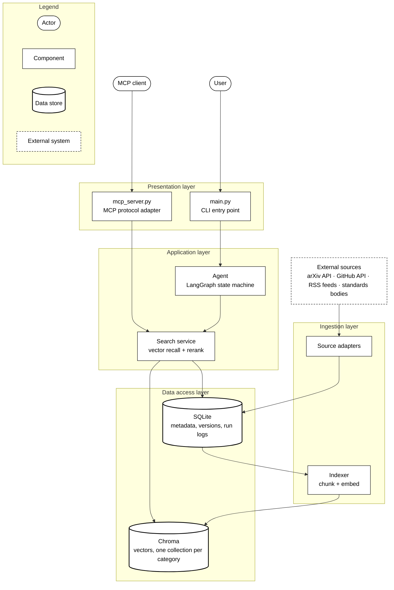
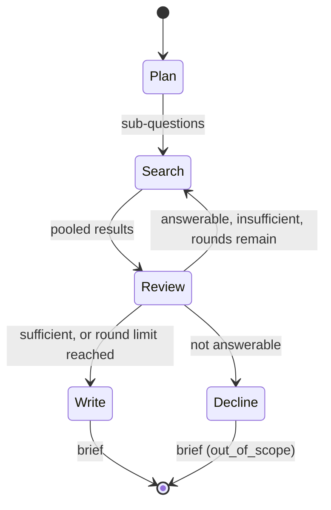

# Research Assistant

Answers technical research questions from a knowledge base built out of
public sources, and returns a brief with cited evidence, a confidence
rating, the gaps it could not fill, and suggested follow-up questions.

The knowledge base covers AI and machine learning systems, drawn from four
independent sources across three categories:

| Category | Sources |
|---|---|
| Technical literature | arXiv papers (cs.CL, cs.AI, cs.LG) |
| Practitioner knowledge | GitHub release notes and READMEs, engineering blog feeds |
| Standards and regulations | NIST AI RMF, EU AI Act, US Executive Order 14110 |

## How it works

The system is a layered architecture: a presentation layer (two
interchangeable entry points), an application layer (the agent and the
search service it calls), an ingestion layer that feeds the data layer,
and a data access layer split between a relational store and a vector
store.



A question is split into sub-questions, each routed to the categories
likely to answer it. The agent then judges whether what it found is
relevant and enough; if not enough, it searches again for what is
missing, up to a limit. Only once the evidence is judged both relevant
and sufficient does it write the brief, citing passages by number. Those
numbers are resolved back to real sources in code rather than by the
model, so a citation is either genuine or dropped.

The agent itself is a finite state machine (see `agent/graph.py`), not a
straight line — how many search rounds a question takes depends on what
the evidence turns out to look like:



## Setup

Requires Python 3.12 or newer.

```bash
python3 -m venv .venv
.venv/bin/pip install -e ".[dev]"

cp .env.example .env
```

Then edit `.env`: set `GROQ_API_KEY` (free tier at console.groq.com), or
set `LLM_PROVIDER=ollama` to run the language model locally instead.
`GITHUB_TOKEN` is optional and raises the GitHub API rate limit.

## Usage

Build the knowledge base first, then ask it questions.

```bash
# 1. Fetch documents. Start small; raise --max-results to fetch more.
.venv/bin/python main.py ingest arxiv --max-results 500
.venv/bin/python main.py ingest github
.venv/bin/python main.py ingest rss_blog
.venv/bin/python main.py ingest gov_standards

# 2. Embed and index them for search.
.venv/bin/python main.py index

# 3. Ask questions.
.venv/bin/python main.py
```

```
Question> What are the tradeoffs of speculative decoding for LLM inference?
```

Other commands:

```bash
.venv/bin/python main.py stats                  # what is stored, and how current it is
.venv/bin/python main.py eval --skip-agent      # retrieval quality, no model calls
.venv/bin/python main.py eval                   # full evaluation
.venv/bin/python main.py schedule               # refresh all sources every 24h
.venv/bin/pytest tests/ -q                      # tests

# Reach further back in a source's history
.venv/bin/python main.py ingest arxiv --backfill --start-offset 5000
```

## MCP server

The knowledge base is also exposed over the Model Context Protocol, so
other tools can search it. It provides four tools:
`search_knowledge_base`, `get_document`, `corpus_stats`, and
`source_freshness`.

Run it directly:

```bash
.venv/bin/research-agent-mcp
```

Or add it to an MCP client's configuration, replacing the paths with
where this project lives on your machine:

```json
{
  "mcpServers": {
    "research-agent": {
      "command": "/path/to/Engineering_Research_Agent/.venv/bin/python",
      "args": ["-m", "research_agent.mcp_server"],
      "cwd": "/path/to/Engineering_Research_Agent"
    }
  }
}
```

## Layout

```
main.py                       Entry point: interactive session and commands
research_agent/
  config.py                   Settings, read from .env
  models.py                   Document and Chunk schema
  storage.py                  SQLite schema, connections, queries
  ingestion/
    pipeline.py               Hashing, change detection, versioning, run logs
    arxiv.py github.py rss.py standards.py
  retrieval/
    indexer.py                Chunking, embedding, indexing
    search.py                 Vector search, reranking, context building
  agent/
    prompts.py                Prompts for each reasoning step
    nodes.py                  Plan, route, assess gaps, synthesise, build brief
    graph.py                  How those steps connect, including the loop
  evaluation.py               Query set, metrics, evaluation runner
  scheduler.py                Recurring ingestion
  mcp_server.py               MCP tools
tests/
docs/                         Design notes, evaluation results, example output
```

## Documentation

- [docs/DESIGN.md](docs/DESIGN.md) — decisions, tradeoffs, and limitations
- [docs/EVALUATION.md](docs/EVALUATION.md) — what was measured and what it showed
- [docs/EXAMPLE_BRIEF.md](docs/EXAMPLE_BRIEF.md) — a real answer, end to end
- [docs/REFLECTION.md](docs/REFLECTION.md) — what worked, what would change
