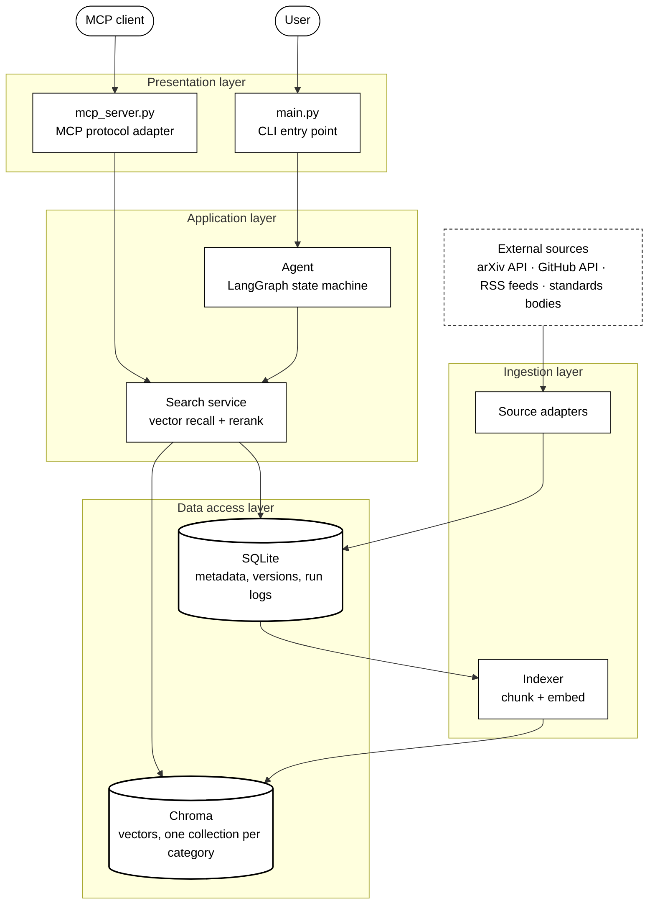
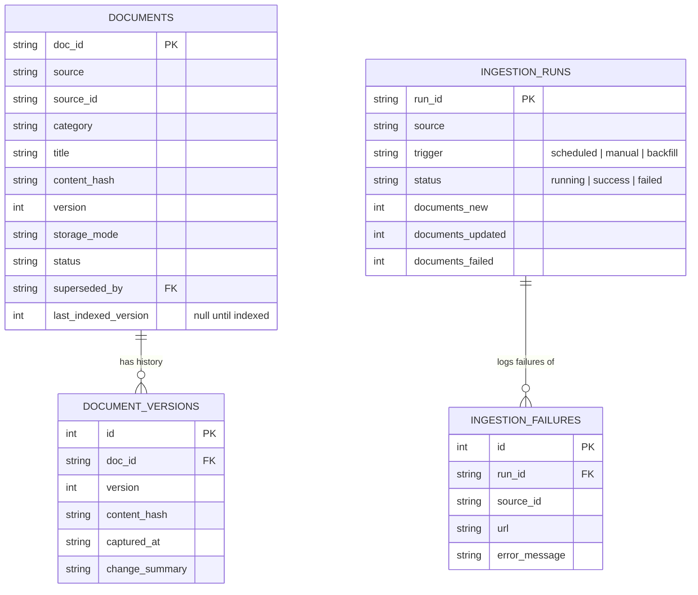
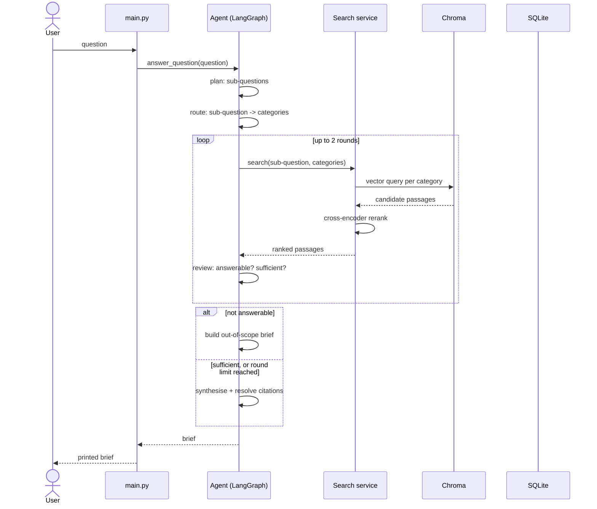

# Design

## Scope

The system covers AI and machine learning systems: model architectures,
inference tooling, and the regulation around them. That domain was chosen
because it has genuinely different source types — peer-reviewed papers,
fast-moving engineering changelogs, and slow-moving policy documents — so
the pipeline has to handle real variation rather than four flavours of the
same feed.

Ingestion, retrieval, and evaluation carry the most engineering weight.
The agent and MCP server are complete but deliberately narrow: one
reasoning loop and four tools, rather than more surface area that would
not have been measured.

## Architecture

A layered view: two interchangeable entry points over one application
layer, an ingestion layer that feeds a data access layer split between a
relational store and a vector store.

There is no HTTP API. Both entry points call the same code in the same
process, which gives the separation an API would provide without a
network hop, a second process to keep running, or request schemas
duplicating the Pydantic models that already exist. If browser access
were needed later, an HTTP layer would sit alongside `main.py` without
touching anything beneath it.

## Data

**One schema for every source.** Every adapter produces the same
`Document`, so nothing downstream needs to know where a document came
from. Two fields do the heavy lifting:

- `doc_id` is `sha256(source:source_id)` rather than a random UUID.
  Re-fetching an item therefore lands on the same row, which turns
  re-ingestion into an update instead of a duplicate-detection problem.
- `content_hash` is a hash of the normalised text. Unchanged text means
  the run skips the document; changed text bumps its version and appends
  to `document_versions`. An arXiv paper revised from v1 to v2 keeps its
  identity and gains a version, rather than appearing twice.

**Storage mode is decided per source, by what each one gives cheaply.**
GitHub returns release notes and READMEs as plain text, so those are
stored whole. arXiv gives abstracts for free but full text only via PDF
download and parsing, so only a bounded recent subset gets full text.
RSS feeds vary: whatever the publisher includes is what gets stored, down
to metadata only for feeds that publish nothing but titles. Standards
documents are few enough that all are stored in full.

**Sources are shaped differently on purpose.** arXiv and GitHub have
paginated APIs, so they support real backfill. RSS feeds expose only
recent posts, with no way to page backwards. Standards bodies publish no
search API at all, so that source reads an explicit list of document URLs
and re-checks each for changes — adding coverage means editing a JSON
file, not writing code.

**One pipeline, four adapters.** Adapters only fetch and map. Hashing,
change detection, versioning, duplicate detection, and run logging live in
`ingestion/pipeline.py`, so they cannot drift apart between sources. Each
document is committed on its own, so a network failure partway through a
long run keeps everything already stored. Items that fail to fetch are
returned as `FetchFailure` values and recorded in a table, so they appear
in the run's statistics rather than only in a log.

The relational schema this pipeline writes to:

`document_versions` is append-only history, never updated or deleted —
one row per content change. `last_indexed_version` on `documents` is what
makes indexing incremental: a document is only re-embedded when it
differs from `version`. `superseded_by` is a real column with no code
path that sets it yet — the schema anticipates document supersession,
nothing currently detects or acts on it.

## Retrieval

**Chunking** is 1000 characters with 150 of overlap, split on paragraph
then sentence boundaries. That size holds a complete idea while staying
inside the embedding model's 512-token limit; the overlap keeps a sentence
that straddles a boundary intact in at least one chunk. The same settings
apply to every source, which is a simplification — per-category tuning
would be the next step once there is evidence it matters.

**Embeddings** use `bge-small-en-v1.5`, run locally on CPU. It is
asymmetric: queries take an instruction prefix that indexed passages must
not have. Handling that directly, rather than through a wrapper library,
keeps the behaviour visible in one place.

**Vector storage** is Chroma, with one collection per category. Category
filtering is therefore structural — a search limited to standards never
touches the other collections' vectors, rather than scanning everything
and discarding results afterwards.

**Search runs in two stages.** Vector similarity shortlists candidates
per category quickly, then a cross-encoder rescores that shortlist by
reading query and passage together. The second stage is more accurate but
far slower, which is exactly why it only ever sees a shortlist.

**Freshness** is checked against SQLite at query time rather than stored
with the vectors, because a document can be marked superseded without its
text changing — a copy held beside the vectors would quietly go stale.

## Agent

Five steps: plan the sub-questions, route each to likely categories,
search, review the evidence, and either write the brief or decline. The
review step makes two separate judgements — whether the evidence is
relevant at all, and whether there is enough of it — and both matter:
"not relevant" ends the run and reports why; "relevant but thin" starts
another search round for whatever is missing, capped at two rounds.

That loop is why the workflow is a graph rather than a straight line: how
many searches a question needs, and whether it can be answered at all,
depends on what the searches turn up. LangGraph wires the steps and
carries state; every decision — what to search for, which categories,
whether to continue, what to claim — is made by prompts and typed models
in `agent/nodes.py`, not by a prebuilt agent abstraction.

One question's actual message flow through the components involved:

The `loop`/`alt` blocks map directly onto `next_step`'s branching in
`agent/graph.py`: not answerable ends the run immediately; answerable but
thin starts another `search` round; sufficient (or the round cap hit)
moves to writing.

**Citations cannot be fabricated.** The model cites passages by number.
Those numbers are resolved to titles and URLs by ordinary Python, looking
up only the passages actually retrieved. A number the model invents
resolves to nothing and is dropped, so a citation in a brief is either
real or absent.

**Routing is batched.** All sub-questions are routed in one model call
rather than one call each, so the number of API requests per question stays
flat regardless of how many sub-questions were planned.

**Questions outside the corpus are declined — by judgement, not by a score
threshold.** The first version of this compared the best reranker score
against a fixed cutoff, set from the gap between scores on in-domain and
out-of-domain evaluation queries. It broke on the first real question
tried outside that set: "what is AI" scored *lower* than "what is the
capital of France", because reranker scores rank passages within one
query and are not comparable across queries — a short, general question
scores low against long technical passages regardless of topic, so a
numeric cutoff has no way to tell "broad but answerable" apart from
"unrelated". No threshold value fixes this; the two cases overlap in the
wrong order.

The fix moved the decision into the review step already in the loop: the
model is shown the question and the retrieved passages together and
judges whether the material actually bears on the question, the same way
it already judges whether there is enough of it. This costs no extra
model call, and it is exactly the kind of judgement a language model
should be better suited for than a similarity score is.

## Evaluation

Two things are measured, described fully in `EVALUATION.md`: whether
search finds the right material, and whether the written answer is
grounded in what it found. The query set includes questions the corpus
cannot answer, because a system that invents an answer for those is worse
than one that says it does not know.

## Known limitations

- **Category routing can hurt.** Committing to a category before
  searching means a relevant document in a different category is invisible
  to that sub-question. When the chosen category is thinly covered, the
  system returns the best of a weak set instead of looking wider. This is
  measured in `EVALUATION.md`.
- **Corpus size affects results.** A smaller sample leaves some topics
  thinly covered, and some evaluation findings reflect that rather than
  anything structural.
- **RSS history is shallow.** Feeds expose only recent posts, so there is
  no way to backfill older ones without a different mechanism entirely.
- **Some feeds carry no text.** Those become metadata-only records.
  Fetching the linked article would fix it, at the cost of a request per
  entry and a new way to fail.
- **Standards coverage is only as broad as its URL list**, since no
  discovery API exists to crawl.
- **Free-tier API limits are real.** A full evaluation makes enough model
  calls to exhaust a free daily quota, which is why every query is isolated
  and a rate-limit error is recorded rather than fatal.
- **The relevance judgement relies on the model, not a fixed rule.** It is
  more reliable than a score threshold, since it reasons about meaning
  rather than comparing a number across unrelated queries, but it is only
  as good as that reasoning — a small or unreliable model may judge
  relevance inconsistently. This has not been measured against the local
  fallback model specifically.

## What would come next

1. Fall back to an unrestricted search when a category-limited one returns
   little or scores poorly. The relevance judgement catches questions the
   corpus cannot answer at all; this would catch the narrower case where
   the answer exists but sits in a category the router did not choose.
2. Tune chunk size per category, once there is measurement to justify it.
3. Grow the corpus and re-run the evaluation, to separate corpus-size
   effects from design ones.
4. Extend the evaluation query set with more out-of-domain and
   broad-but-answerable questions. The one out-of-domain query it had was
   not enough to catch the scoring approach being wrong in the first
   version of the scope check, and a single example is thin evidence for
   any behaviour meant to generalise.
